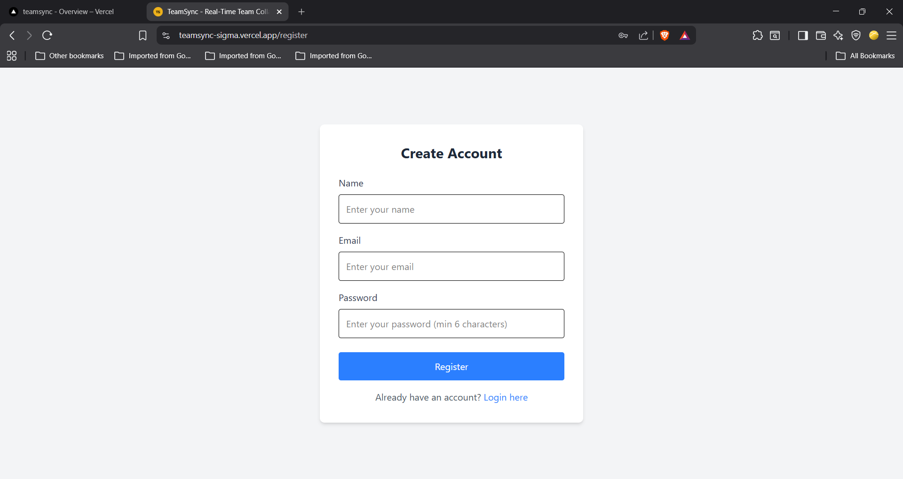
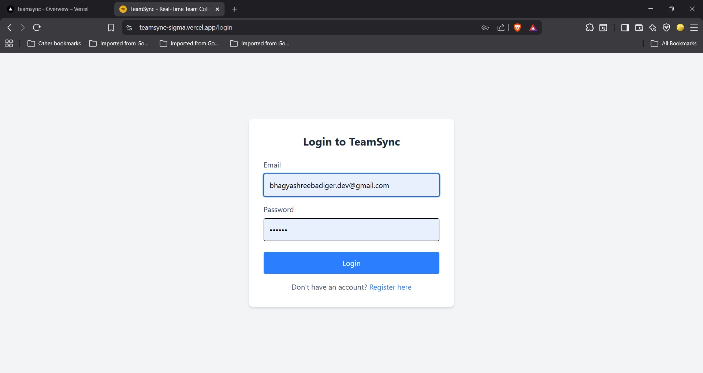
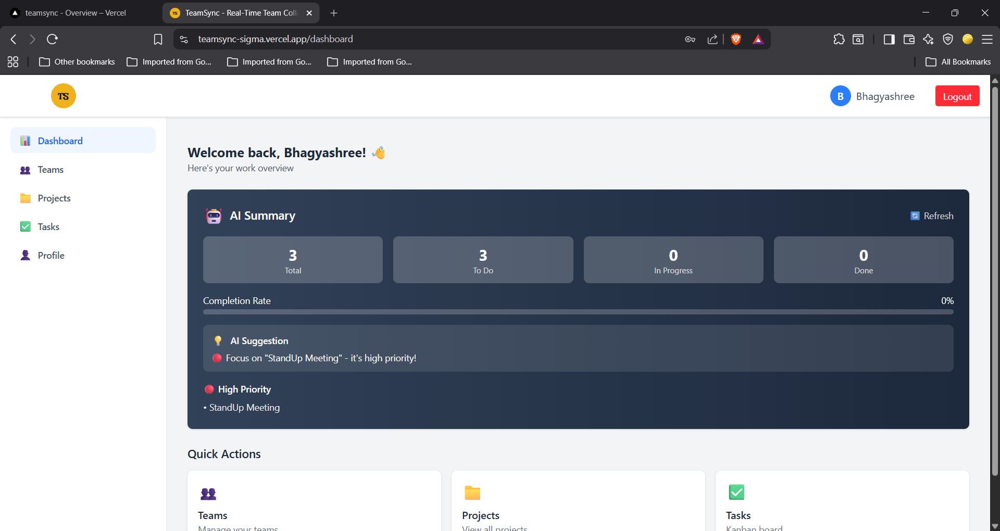
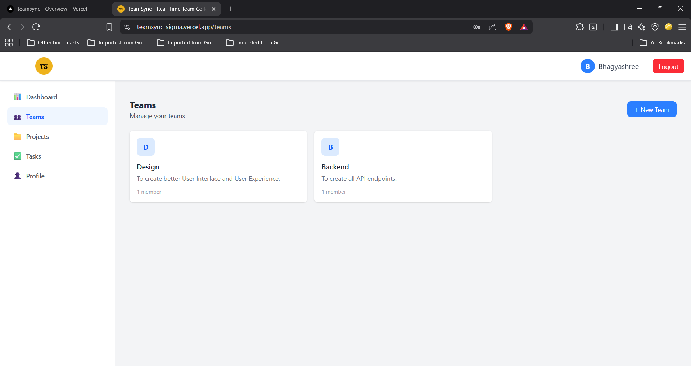
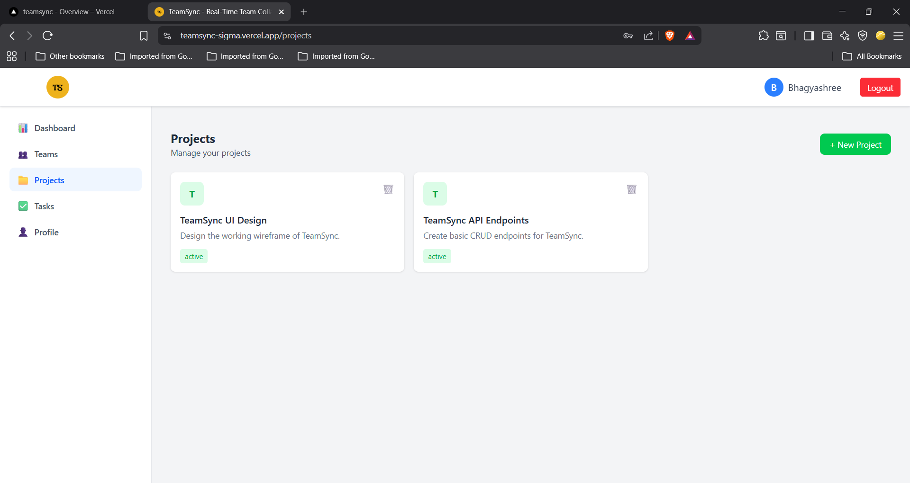
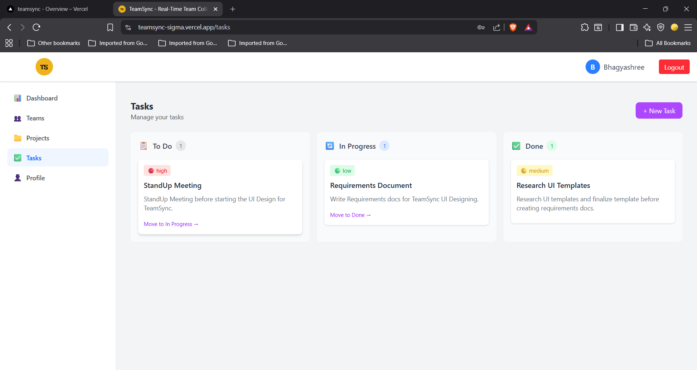
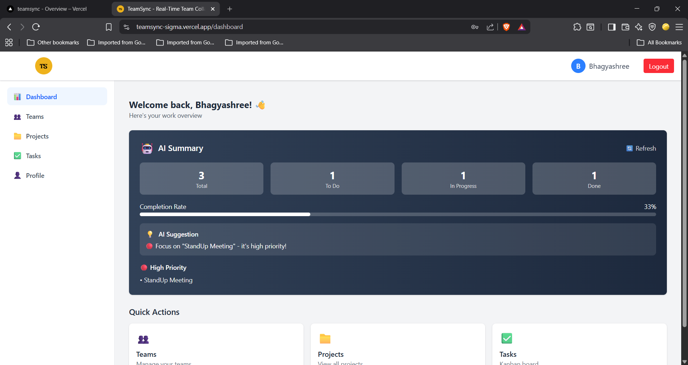

# TeamSync - Real-Time Team Collaboration App

A full-stack team collaboration application with real-time notifications, task management, and AI-powered suggestions.


##  Live Demo

- **Frontend:** [https://teamsync-sigma.vercel.app](https://teamsync-sigma.vercel.app)

- **Backend:** [https://teamsync-api-omo6.onrender.com](https://teamsync-api-omo6.onrender.com)


##  Features

- **User Authentication** - Register, login, JWT-based auth
- **Team Management** - Create teams, invite members by email
- **Project Management** - Organize work into projects
- **Task Management** - Create, update, delete tasks with status tracking
- **Real-Time Notifications** - Socket.io powered instant updates
- **AI Suggestions** - Smart task recommendations using Hugging Face API
- **Activity Tracking** - See what's happening across your teams


## Screenshots

### Register / Sign Up Page


### Login Page


### Dashboard


### Teams


### Projects


### Tasks


### AI-Powered Summary



##  Tech Stack

### Backend
- Node.js + Express
- TypeScript
- MongoDB + Mongoose
- Socket.io
- JWT Authentication
- Hugging Face AI API

### Frontend
- React + Vite
- TypeScript
- Tailwind CSS
- React Router
- Axios
- React Hot Toast

### Deployment
- Backend: Render
- Frontend: Vercel
- Database: MongoDB Atlas
- Monitoring: UptimeRobot


## Quick Start

### Prerequisites
- Node.js 18+
- MongoDB Atlas account
- Git (Install and Account Setup)

### Clone & Install

```bash
git clone https://github.com/bshree11/teamsync.git
cd teamsync

# Install backend
cd backend
npm install

# Install frontend
cd ../frontend
npm install
```

### Environment Variables

**Backend (`backend/.env`):**

PORT=5000
NODE_ENV=development
MONGODB_URL=your_mongodb_url
JWT_SECRET=your_secret_key
JWT_EXPIRES_IN=7d
HUGGINGFACE_API_KEY=your_hf_key


**Frontend (`frontend/.env`):**
VITE_API_URL=http://localhost:5000/api

### Run Locally

```bash
# Terminal 1 - Backend
cd backend
npm run dev

# Terminal 2 - Frontend
cd frontend
npm run dev
```

## 📁 Project Structure
```
teamsync/
├── backend/
│   ├── src/
│   │   ├── config/         # Database & Socket config
│   │   ├── controllers/    # Route handlers
│   │   ├── middleware/     # Auth middleware
│   │   ├── models/         # MongoDB models (User, Team, Project, Task, Activity, Notification)
│   │   ├── routes/         # API routes
│   │   ├── tests/          # Jest tests
│   │   ├── types/          # TypeScript types
│   │   ├── utils/          # JWT utilities
│   │   └── server.ts       # Entry point
│   ├── package.json
│   └── tsconfig.json
├── frontend/
│   ├── src/
│   │   ├── components/     # Reusable UI components
│   │   ├── pages/          # Page components
│   │   ├── services/       # API services
│   │   ├── types/          # TypeScript types
│   │   └── App.tsx         # Main app
│   ├── package.json
│   └── vite.config.ts
├── screenshots/            # App screenshots
├── api-docs.md             # API documentation
├── challenges.md           # Challenges & solutions
├── deployment.md           # Deployment guide
├── tools.md                # Tools & technologies
├── user-guide.md           # User guide
└── README.md
```

##  API Endpoints

 Method        Endpoint           Description 

 POST     /api/auth/register       Register user 
 POST     /api/auth/login          Login user 
 GET      /api/auth/me             Get current user 
 GET      /api/teams               Get all teams 
 POST     /api/teams               Create team 
 POST     /api/teams/:id/members   Add member 
 GET      /api/projects            Get all projects 
 POST     /api/projects            Create project 
 DELETE   /api/projects/:id        Delete project 
 GET      /api/tasks               Get all tasks 
 POST     /api/tasks               Create task 
 PUT      /api/tasks/:id           Update task 
 GET      /api/ai/summary          Get AI suggestions 


## ✅ Tests

```bash
cd backend
npm test
```

**24 tests passing** (7 model tests, 4 auth tests, 3 task tests, 10 frontend tests)

##  Author

**Bhagyashree Badiger**
- GitHub: [@bshree11](https://github.com/bshree11)

